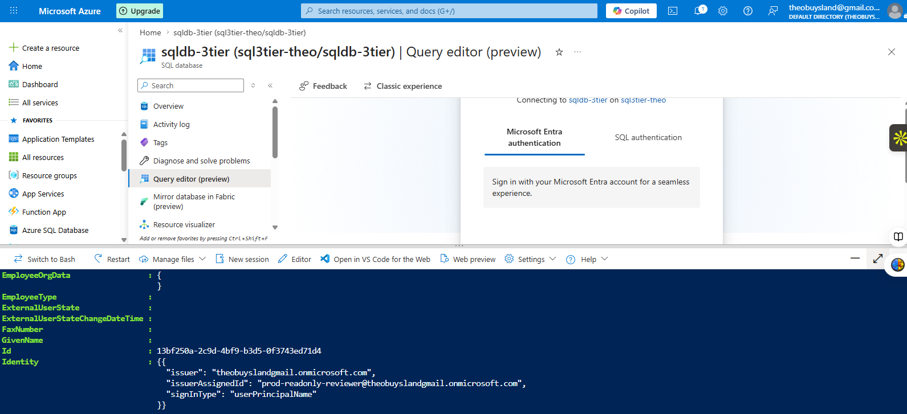
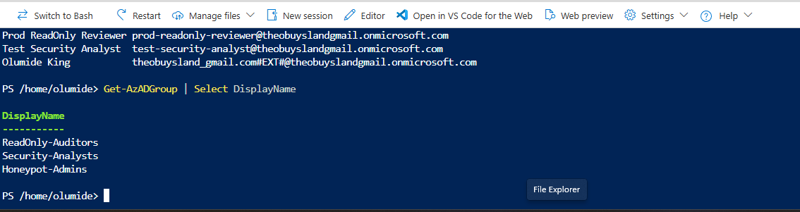
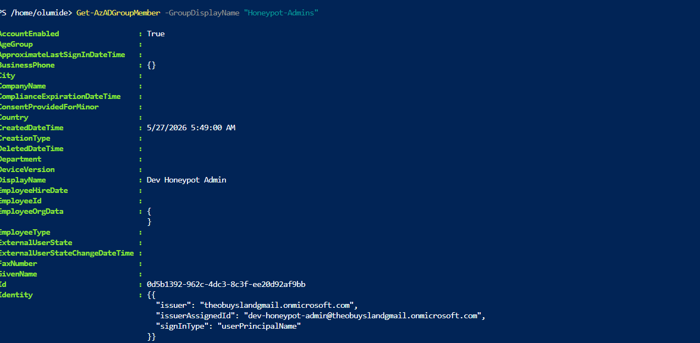
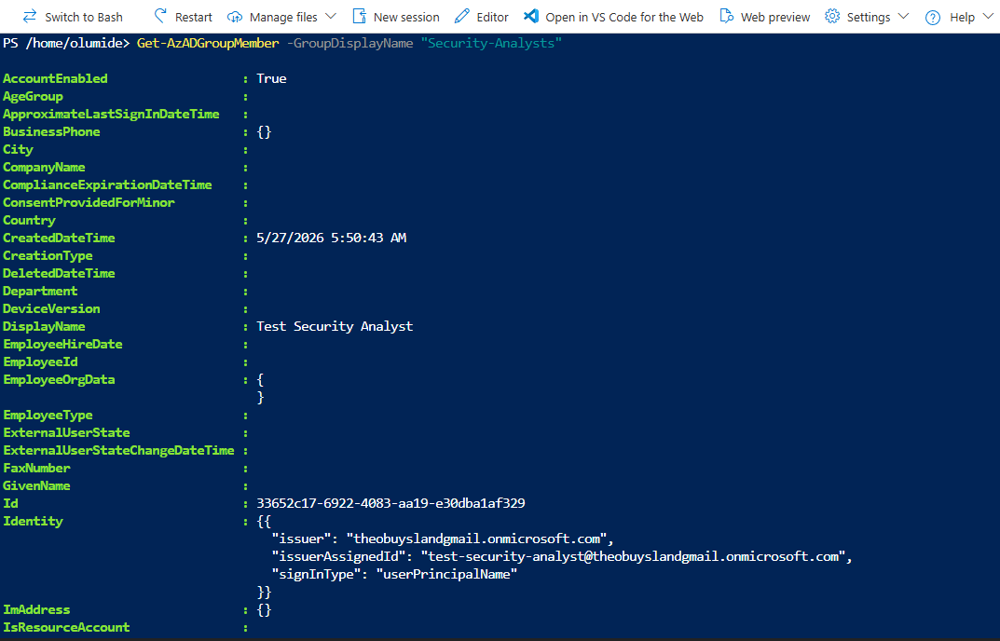
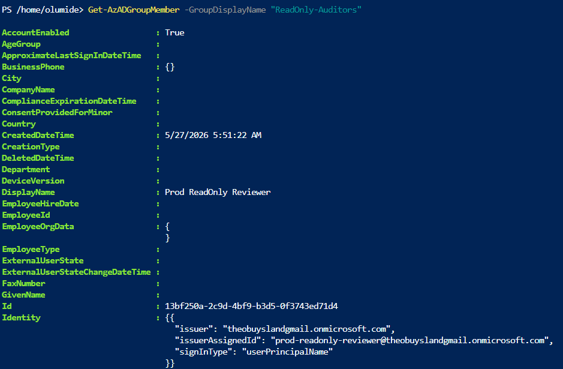
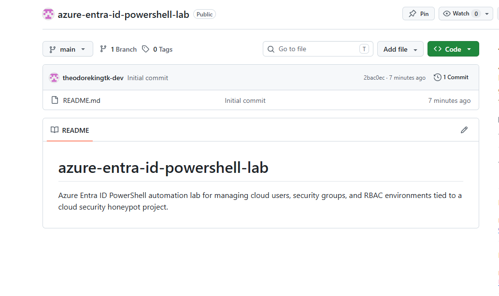

# Azure Entra ID PowerShell Lab

Enterprise-style Microsoft Azure Entra ID (Azure AD) automation lab focused on cloud identity management, RBAC administration, PowerShell automation, and multi-environment user provisioning integrated with a cloud security honeypot architecture.

This project was designed to simulate how cloud engineers and security administrators manage enterprise identities, role-based access control (RBAC), security groups, and environment separation in real-world Azure environments.

The lab directly integrates with and expands upon the following projects:

- Azure 3-Tier Cloud Project
- Azure Honeypot Security Lab

Together, these projects simulate a realistic enterprise cloud + security operations environment inside Microsoft Azure.

---

# Project Objectives

The purpose of this project was to:

- Learn Azure Entra ID (Azure Active Directory) administration
- Practice PowerShell automation in Azure
- Build cloud identity management workflows
- Create multiple enterprise-style cloud users
- Create RBAC security groups
- Simulate development, production, and security environments
- Practice cloud security administration concepts
- Automate identity management tasks using PowerShell
- Integrate identity infrastructure into an Azure security lab
- Create a portfolio-ready cloud IAM project

---

# How This Project Connects to the Azure Honeypot Security Lab

This project extends the previous Azure Honeypot Security Lab by adding enterprise identity and access management.

The Honeypot Security Lab focused on:

- Frontend credential capture simulation
- Backend API logging
- Azure SQL credential monitoring
- Cloud security monitoring workflows

This Entra ID lab expands the environment by introducing:

- Enterprise cloud user management
- Security group administration
- RBAC-based access control
- Identity segmentation
- Environment-specific permissions
- PowerShell automation workflows

Together, the projects simulate how enterprise security teams manage identities and cloud access surrounding security monitoring systems.

---

# How This Project Connects to the Azure 3-Tier Cloud Project

This project also ties directly into the Azure 3-Tier Cloud Project architecture.

The Azure 3-Tier Project demonstrated:

- Frontend App Service deployment
- Backend API communication
- Azure SQL integration
- Multi-tier cloud architecture
- Cloud networking and deployment concepts

This Entra ID project expands that architecture by adding:

- Identity governance
- Administrative access management
- Security operations RBAC
- Production environment separation
- Cloud IAM automation

This creates a more realistic enterprise cloud infrastructure model.

---

# Enterprise Identity Architecture

## Identity Environment Structure

The environment was divided into multiple simulated enterprise roles:

| Environment Role | Purpose |
|---|---|
| Dev Honeypot Admin | Administrative management of honeypot resources |
| Test Security Analyst | Security monitoring and investigation |
| Prod ReadOnly Reviewer | Read-only production auditing |
| Cloud Tenant Owner | Main tenant administrator |

---

# RBAC Security Groups Created

## Honeypot-Admins

Administrative security group for managing honeypot infrastructure.

Responsibilities:
- Administrative access
- Cloud resource management
- Identity management
- Security configuration

---

## Security-Analysts

Security operations monitoring group.

Responsibilities:
- Threat monitoring
- Security investigation
- Log analysis
- Incident review

---

## ReadOnly-Auditors

Production audit and review group.

Responsibilities:
- Read-only environment access
- Compliance review
- Security auditing
- Monitoring validation

---

# Cloud Security Concepts Demonstrated

This project demonstrates several enterprise cloud security concepts:

- Azure IAM administration
- RBAC security models
- Identity lifecycle management
- PowerShell automation
- Principle of least privilege
- Security group segmentation
- Administrative isolation
- Enterprise identity governance
- Cloud access management
- Security operations workflows

---

# Technologies Used

## Cloud Platform
- Microsoft Azure

## Identity Services
- Azure Entra ID
- Azure Active Directory RBAC

## PowerShell Modules
- Az PowerShell Module
- AzureAD Module
- Microsoft Graph PowerShell

## Cloud Services
- Azure Cloud Shell
- Azure Resource Groups
- Azure App Services
- Azure SQL Database

## Development Tools
- PowerShell
- GitHub
- Visual Studio Code

---

# PowerShell Tasks Performed

The project included:

1. Connecting to Azure PowerShell
2. Connecting to Microsoft Graph
3. Retrieving Azure tenant information
4. Enumerating Azure resource groups
5. Creating enterprise cloud users
6. Creating RBAC security groups
7. Assigning users to security groups
8. Validating RBAC memberships
9. Simulating enterprise IAM workflows
10. Integrating IAM structure into security lab architecture

---

# Users Created

| Display Name | Purpose |
|---|---|
| Dev Honeypot Admin | Honeypot administration |
| Test Security Analyst | Security operations testing |
| Prod ReadOnly Reviewer | Production auditing |
| Olumide King | Tenant owner/admin |

---

# Real-World Skills Demonstrated

This project demonstrates practical cloud engineering and security administration skills including:

- Azure administration
- Identity and access management
- Enterprise RBAC design
- Cloud PowerShell automation
- Cloud governance
- Security operations alignment
- Azure tenant management
- Cloud identity architecture
- Security administration workflows
- Infrastructure documentation

---

# Key Challenges Solved

Throughout the project several real-world cloud engineering and IAM issues were encountered and resolved:

- Azure Cloud Shell authentication issues
- Microsoft Graph device authentication timeouts
- PowerShell module compatibility problems
- RBAC membership validation
- Azure tenant enumeration
- Microsoft Graph connection troubleshooting
- Azure AD cmdlet usage
- Cloud identity automation debugging

These troubleshooting scenarios provided valuable real-world cloud engineering experience.

---

# Screenshots

## Azure Cloud Shell PowerShell Environment

---

## Entra ID Security Groups Created

---

## Entra ID Users Created

---

## Honeypot Admin RBAC Membership

---

## Security Analyst RBAC Membership

---

## ReadOnly Auditor RBAC Membership

---

## GitHub Repository Overview

---

# Project Results

Successfully achieved:

- Enterprise-style Entra ID environment
- Working PowerShell automation workflows
- Multiple cloud users created
- Multiple RBAC groups created
- RBAC memberships assigned
- Cloud IAM segmentation
- Azure tenant administration
- Microsoft Graph integration
- Cloud security operations simulation
- Portfolio-ready cloud IAM project

---

# Future Improvements

Potential future upgrades include:

- Conditional Access Policies
- Multi-Factor Authentication (MFA)
- Azure Privileged Identity Management (PIM)
- Dynamic security groups
- Azure Sentinel integration
- SIEM identity monitoring
- Identity Protection policies
- Terraform IAM automation
- Azure Key Vault integration
- Hybrid Active Directory synchronization
- Enterprise SSO integrations

---

# Related Projects

## Azure Honeypot Security Lab

A cloud security project focused on:
- Credential harvesting simulation
- Azure SQL logging
- Backend API monitoring
- Cloud security workflows

---

## Azure 3-Tier Cloud Project

A cloud engineering project focused on:
- Frontend deployment
- Backend API infrastructure
- Azure SQL integration
- Multi-tier architecture
- Cloud deployment workflows

---

# Author

## Theodore King

Cloud Security | Azure | AWS | ServiceNow | Identity & Access Management | Infrastructure Security Projects
